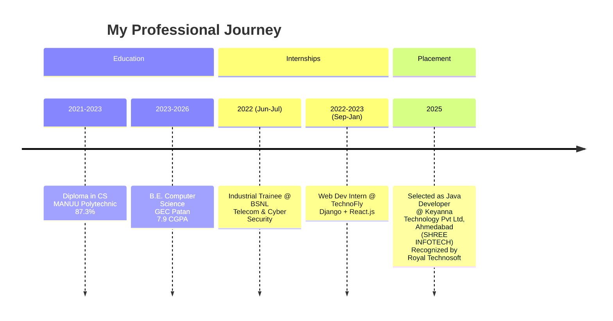

<!-- ========== NEW: ANIMATED WAVE HEADER ========== -->

  

<!-- ========== NEW: TYPING ANIMATION INTRO ========== -->

  

<!-- ========== NEW: AUTHOR & ARCHITECT SECTION ========== -->
## 👨‍💻 Author & Architect

<table>
<tr>
<td align="center" width="160">
  <a href="https://github.com/Sadique721">
     
    <b>Md Sadique Amin</b> 
    Backend Java Developer
  </a>
</td>
<td>

**Md Sadique Amin** — Backend Java Developer.

- 🔗 GitHub: [@Sadique721](https://github.com/Sadique721)
- 📧 Email: mdsadiqueamin721786@gmail.com
- 🏗️ Built: Enterprise BSS-OSS Telecom Suite, Backend Java Developer, IR Interconnect & Roaming

</td>
</tr>
</table>

---

Personal GitHub Profile README

<!-- ========== NEW: ANIMATED HEADER BANNER ========== -->

<!-- ========== NEW SECTIONS ADDED PER LATEST REQUEST ========== -->

<!-- 1. 🔥 ACHIEVEMENT HIGHLIGHT BANNER (PLACEMENT RECOGNITION) -->

  

<!-- 2. 🏆 ACHIEVEMENTS & RECOGNITION (EXPANDED) -->
## 🏆 Major Career Achievement – Placement Recognition

> **Recognized by Royal Technosoft Pvt. Limited** for successfully placing **Md Sadique Amin** at **Keyanna Technology Pvt Ltd, Ahmedabad** as a **Java Developer** (SHREE INFOTECH Placement Track).

I am deeply honored to share that my technical skills, consistency, and dedication have been officially recognized by **Royal Technosoft Pvt. Limited** – a leading recruitment and training partner. This achievement marks a significant milestone in my journey as a software engineer.

**Key Highlights:**

- ✅ **Selected as Java Developer** at **Keyanna Technology Pvt Ltd, Ahmedabad** (SHREE INFOTECH Placement Track) – a fast‑growing IT solutions company.
- ✅ Recognized by **Royal Technosoft Pvt. Limited** with a formal achievement award.
- ✅ The award citation reads:  
  > *"Wishing continued success and career growth"* – Royal Technosoft Pvt. Limited

- ✅ This placement validates my strong foundation in **Java, Spring Boot, and full‑stack development**.

**Reflection:**  
This achievement is not just a job offer – it's a testament to years of late‑night debugging, countless projects, and an unwavering passion for coding. I'm excited to bring my energy, problem‑solving mindset, and technical expertise to Keyanna Technology Pvt Ltd, Ahmedabad and contribute to impactful software solutions.

---

### 🎓 Academic & Internship Achievements

- 🥇 **Top 10%** in Department (CSE) – Consecutive semesters
- 🏅 **College Merit Scholarship** (2024‑25)
- 🏆 **Best Project Award** – EntityKart e‑commerce platform at GEC Patan Tech Fest 2025
- 💻 **Smart India Hackathon 2025 Finalist** – Software edition
- 📄 **Published Technical Writer** – 5+ articles on Java, Spring Boot (10k+ reads)
- 🔧 **Open Source Contributor** – 2 merged PRs to a CRUD generator tool

---

### 💼 Career Milestone Timeline

<!-- ========== NEW: FOOTER WAVE ANIMATION ========== -->

  

