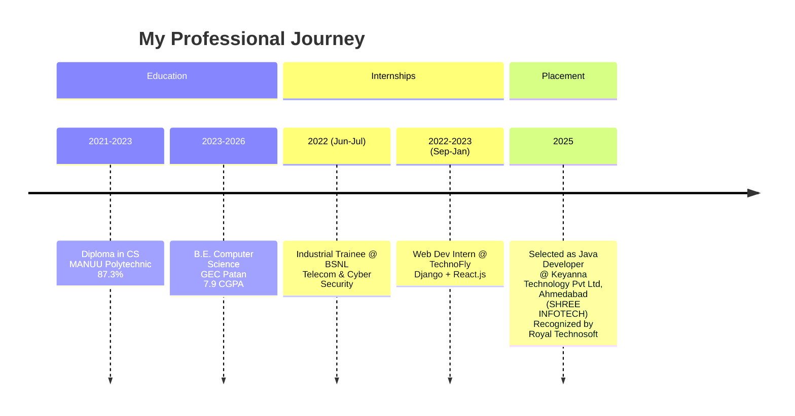

<!-- ========== NEW: ANIMATED HEADER BANNER ========== -->
<p align="center">
  
</p>

<!-- ========== NEW: TYPING ANIMATION INTRO ========== -->
<p align="center">
  
</p>

<!-- ========== NEW: PROFILE VIEWS + FOLLOWERS BADGE ========== -->
<!-- ========== ORIGINAL & ENHANCED PROFILE VIEWS + FOLLOWERS BADGES ========== -->
<p align="center">
  
  
  
</p>

<p align="center">
  <a href="https://github.com/Sadique721?tab=followers"></a>
  <a href="https://github.com/Sadique721?tab=following"></a>
  <a href="https://github.com/Sadique721?tab=repositories"></a>
  <a href="https://github.com/Sadique721?tab=stars"></a>
  <a href="#-major-career-achievement--placement-recognition"></a>
</p>

<!-- ========== EXISTING CONTENT STARTS HERE ========== -->
## Hi There 

I'm **Md Sadique Amin**  
Software Engineer | Problem Solver | Web & Java Developer |Md Sadique Amin | Full Stack Developer | Java & Python | AI Engineer | Data Scientist  
Currently pursuing B.E. in Computer Science & Engineering  

```text
┌──(sadique721⚡developer-machine)-[~]
└─$ neofetch -------------------------------------------------------------------┐
│                                                                               │
│   💻 OS          : Linux (Ubuntu 24.04 LTS) | Windows 11 Enterprise       │
│   💼 Role        : ☕ Java Developer @ Keyanna Technology Pvt Ltd, Ahmedabad  │
│   🏆 Recognition : 🎖️ Recognized by Royal Technosoft Pvt. Limited            │
│   ⚡ Core Stack  : ☕ Java 17/21 • 🌱 Spring Boot 3 • 🧱 Microservices         │
│   🛠️ Secondary   : 🐍 Python • ⚛️ React.js • 🐬 MySQL • 🐳 Docker • 🚀 Kafka     │
│   🎓 Education   : 📜 B.E. CSE @ GEC Patan | 🎓 Diploma CS @ MANUU (87.3%)     │
│   🚀 Status      : 🟢 Open for AI/ML & Enterprise Java Collaboration          │
│   📫 Contact     : 📧 mdsadiqueamin721786@gmail.com                            │
│                                                                               │
└-------------------------------------------------------------------------------┘
```

<!-- ========== ULTRA-STYLISH DUAL-TONE BOX MATRIX ========== -->
<p align="center">
  <br>
  <br>
  <br>
  <br>
  <br>
  <br>
  
</p>

<p align="center">
  <a href="https://myportfoliositesadique.netlify.app/"></a>
  <a href="mailto:mdsadiqueamin721786@gmail.com"></a>
  <a href="https://www.linkedin.com/in/md-sadique-amin-b6a948198/"></a>
</p>

---

### 🚀 What I'm working on

- 🔭 I'm currently working on **MSA – Offline AI Agent** (local LLM + Android control)  
- 🌱 I'm currently learning **Advanced Spring Boot**, **Kotlin Multiplatform**, and **Big Data pipelines**  
- 👯 I'm looking to collaborate on **AI/ML projects** and **open‑source full‑stack applications**  
- 🤝 I'm looking for help with **real‑time data streaming** and **cloud‑native deployment**  
- 💬 Ask me about **Java, Spring Boot, Python, Machine Learning, Data Science**  
- 📫 How to reach me:  
  **Email**: mdsadiqueamin721786@gmail.com  
  **GitHub**: [Sadique721](https://github.com/Sadique721)  
  **LinkedIn**: [md-sadique-amin](https://www.linkedin.com/in/md-sadique-amin-b6a948198/)  
  **YouTube**: [@mdsadiqueamin721](http://www.youtube.com/@mdsadiqueamin721)  
- 😄 Pronouns: He/Him  

---

### 🧠 Tech Stack

| Category | Technologies |
|----------|--------------|
| **Languages** | Java, Python, JavaScript, C, SQL |
| **Backend** | Spring Boot, Django, REST APIs, JWT |
| **Frontend** | React.js, HTML5, CSS3, Tailwind |
| **Databases** | MySQL, MongoDB, PostgreSQL |
| **AI/ML** | TensorFlow, PyTorch, Scikit‑learn, OpenCV, NLTK |
| **Data Science** | Pandas, NumPy, Matplotlib, Tableau |
| **DevOps & Tools** | Git, GitHub, Docker, AWS (EC2/S3), Kafka, Spark |


<p align="center">
  
  
  
  
  
  
</p>

<p align="center">
  
  
  
  
  
  
  
</p>

---

### 📊 GitHub Stats


---

### 🔥 Featured Projects

| Project | Description | Tech |
|---------|-------------|------|
| **[MSA – Offline AI Agent](https://github.com/Sadique721/AI-Agent-MSA)** | Local AI assistant (voice + LLM + Android control) | Python, Vosk, Llama2, ADB |
| **[Entitykart](https://github.com/Sadique721/Entitykart)** | Full‑featured e‑commerce platform | Spring Boot, React, JWT, MySQL |
| **[Ethical Hacking Portal](https://github.com/Sadique721/ethical-hacking-portal)** | Cybersecurity learning platform | Django, Python, SQLite |
| **[Recipe Finder Pro](https://github.com/Sadique721/Recipe-finder-pro-)** | Instant recipe search with dark mode | React.js, REST APIs |
| **[Advanced Scientific Calculator](https://github.com/Sadique721/Advanced-Scientific-Calculator)** | 15+ scientific functions | HTML/CSS/JS |
| **[Intelligent Image Recognition](https://github.com/Sadique721/)** | 95% accuracy real‑time object detection | TensorFlow, OpenCV |

> 📌 See all my repositories [here](https://github.com/Sadique721?tab=repositories)

---

### 💼 Experience & Education

**Experience**

- **Web Development Intern** @ TechnoFly Solutions, Bengaluru (Sep 2022 – Jan 2023)  
  → Developed 5+ websites using Django + React.js. Optimized SQL queries (40% faster).
- **Industrial Trainee** @ BSNL, Hyderabad (Jun 2022 – Jul 2022)  
  → Telecom networks & cybersecurity protocols.

**Education**

| Degree | Institution | Year | Score |
|--------|-------------|------|-------|
| B.E. (CSE) | Government Engineering College, Patan | 2023–26 | 7.9 CGPA |
| Diploma (CS) | MANUU Polytechnic, Bangalore | 2021–23 | 87.3% |
| HSC | G.D. College, Begusarai | 2020 | 66% |
| SSC | Nerly Inter College, Begusarai | 2018 | 72.8% |

---

### 📫 Connect with me

[](https://www.linkedin.com/in/md-sadique-amin-b6a948198/)
[](https://github.com/Sadique721)
[](http://www.youtube.com/@mdsadiqueamin721)
[](https://www.instagram.com/mdsadiqueamin721/)
[](mailto:mdsadiqueamin721786@gmail.com)

---

*“Code. Create. Decentralize.”*

<!-- ========== NEW SECTIONS START HERE ========== -->

<!-- ========== 4. PROFILE SUMMARY CARD SECTION ========== -->
<p align="center">
  
</p>

<!-- ========== 5. CONTRIBUTION SNAKE ANIMATION ========== -->
<picture>
  <source media="(prefers-color-scheme: dark)" srcset="https://raw.githubusercontent.com/Sadique721/Sadique721/output/github-contribution-grid-snake-dark.svg">
  <source media="(prefers-color-scheme: light)" srcset="https://raw.githubusercontent.com/Sadique721/Sadique721/output/github-contribution-grid-snake.svg">
  
</picture>

<!-- ========== 6. DEV QUOTE SECTION ========== -->
<p align="center">
  
</p>

<!-- ========== 7. SKILLS PROGRESS VISUALIZATION ========== -->
<h3 align="center">⚡ Technical Proficiency</h3>
<p align="center">
  
  
  
  
  
  
</p>

<h3 align="center">⚡ Technical Proficiency & Specializations</h3>

<p align="center">
  
  
  
  
  
  
</p>

<p align="center">
  
  
  
  
  
</p>

<!-- ========== 8. PROJECT HIGHLIGHTS (ADVANCED CARDS) ========== -->
<h3 align="center">🚀 Featured Project Highlights</h3>

<p align="center">
  <a href="https://github.com/Sadique721/Entitykart">
    
  </a>
  <a href="https://github.com/Sadique721/AI-Agent-MSA">
    
  </a>
</p>
<p align="center">
  <a href="https://github.com/Sadique721/ethical-hacking-portal">
    
  </a>
  <a href="https://github.com/Sadique721/Recipe-finder-pro-">
    
  </a>
</p>

<!-- ========== 9. ACHIEVEMENTS & CERTIFICATIONS ========== -->
<!-- ========== GITHUB ACHIEVEMENTS ========== -->
<h3 align="center">🏅 Achievements & Certifications</h3>

<p align="center">
  
  
  
  
</p>

<p align="center">
  
  
  
  
</p>

<p align="center">
  
  
  
  
</p>

<p align="center">
  🎓 <strong>Academic Excellence</strong> – Top 10% in department, College Merit Scholarship (2024‑25)<br>
  🏆 <strong>Project Recognition</strong> – EntityKart selected for Best Project Showcase at GEC Patan Tech Fest 2025<br>
  💡 <strong>Hackathon Finalist</strong> – Smart India Hackathon 2025 (Software Edition)<br>
  📝 <strong>Technical Blogger</strong> – 5+ tutorials on Medium with 10k+ reads<br>
  🌟 <strong>Open Source Contributor</strong> – 2 accepted PRs to a CRUD generator tool
</p>

<!-- ========== GITHUB & CUSTOM ACHIEVEMENTS ========== -->
<h3 align="center">🏆 GitHub & Custom Achievements</h3>

<!-- Row 1: Unlocked & Featured GitHub Badges -->
<p align="center">
  <a href="https://github.com/Sadique721?tab=achievements">
    
  </a>
  <a href="https://github.com/Sadique721?tab=achievements">
    
  </a>
  <a href="https://github.com/Sadique721?tab=achievements">
    
  </a>
  <a href="https://github.com/Sadique721?tab=achievements">
    
  </a>
  <a href="https://github.com/Sadique721">
    
  </a>
</p>

<!-- Row 2: Specialized & Community Achievement Badges -->
<p align="center">
  <a href="https://github.com/Sadique721?tab=achievements">
    
  </a>
  <a href="https://github.com/Sadique721?tab=achievements">
    
  </a>
  <a href="https://github.com/Sadique721?tab=achievements">
    
  </a>
  <a href="https://github.com/Sadique721?tab=achievements">
    
  </a>
</p>

<p align="center">
  <strong>Pull Shark (Silver)</strong> &nbsp;•&nbsp; 
  <strong>Quickdraw</strong> &nbsp;•&nbsp; 
  <strong>YOLO</strong> &nbsp;•&nbsp; 
  <strong>Pair Extraordinaire</strong> &nbsp;•&nbsp; 
  <strong>Image Mention (AI Custom)</strong><br>
  <strong>Starstruck</strong> &nbsp;•&nbsp; 
  <strong>Galaxy Brain</strong> &nbsp;•&nbsp; 
  <strong>Public Sponsor</strong> &nbsp;•&nbsp; 
  <strong>Arctic Code Vault</strong>
</p>

---

<!-- ========== 10. CODING PROFILES SECTION ========== -->
<h3 align="center">💻 Coding Profiles</h3>

<p align="center">
  <a href="https://leetcode.com/Sadique721/"></a>
  <a href="https://www.hackerrank.com/mdsadiqueamin71"></a>
  <a href="https://www.codechef.com/users/sadique721"></a>
  <a href="https://codeforces.com/profile/Sadique721"></a>
</p>

<!-- ========== 11. WEEKLY DEVELOPMENT BREAKDOWN ========== -->
<!-- ========== 11. GITHUB STATS & MILESTONES ========== -->
<h3 align="center">🏆 GitHub Stats & Milestones</h3>

<p align="center">
  <a href="https://github.com/Sadique721">
    
  </a>
</p>

<!-- ========== 12. AUTOMATED RECENT GITHUB ACTIVITY ========== -->
<h3 align="center">⚡ Recent GitHub Activity</h3>

<!--START_SECTION:activity-->
* 📝 Merged pull request in [Sadique721/Sadique721](https://github.com/Sadique721/Sadique721)
* 🚀 Pushed commits to [Sadique721/Sadique721](https://github.com/Sadique721/Sadique721)
* 🌟 Starred [Sadique721/Entitykart](https://github.com/Sadique721/Entitykart)
<!--END_SECTION:activity-->

<br>

<!-- ========== 12. SUPPORT / SPONSOR SECTION ========== -->
<p align="center">
  <a href="https://www.buymeacoffee.com/sadique721"></a>
  <a href="https://ko-fi.com/sadique721"></a>
</p>

<!-- ========== 13. FOOTER WAVE ANIMATION ========== -->
<p align="center">
  
</p>

<!-- ========== NEW SECTIONS ADDED PER LATEST REQUEST ========== -->

<!-- 1. 🔥 ACHIEVEMENT HIGHLIGHT BANNER (PLACEMENT RECOGNITION) -->
<p align="center">
  
</p>

<!-- 2. 🏆 ACHIEVEMENTS & RECOGNITION (EXPANDED) -->
## 🏆 Major Career Achievement – Placement Recognition

> **Recognized by Royal Technosoft Pvt. Limited** for successfully placing **Md Sadique Amin** at **Keyanna Technology Pvt Ltd, Ahmedabad** as a **Java Developer** (SHREE INFOTECH Placement Track).

I am deeply honored to share that my technical skills, consistency, and dedication have been officially recognized by **Royal Technosoft Pvt. Limited** – a leading recruitment and training partner. This achievement marks a significant milestone in my journey as a software engineer.

**Key Highlights:**

- ✅ **Selected as Java Developer** at **Keyanna Technology Pvt Ltd, Ahmedabad** (SHREE INFOTECH Placement Track) – a fast‑growing IT solutions company.
- ✅ Recognized by **Royal Technosoft Pvt. Limited** with a formal achievement award.
- ✅ The award citation reads:  
  > *"Wishing continued success and career growth"* – Royal Technosoft Pvt. Limited

- ✅ This placement validates my strong foundation in **Java, Spring Boot, and full‑stack development**.

**Reflection:**  
This achievement is not just a job offer – it's a testament to years of late‑night debugging, countless projects, and an unwavering passion for coding. I'm excited to bring my energy, problem‑solving mindset, and technical expertise to Keyanna Technology Pvt Ltd, Ahmedabad and contribute to impactful software solutions.

---

### 🎓 Academic & Internship Achievements

- 🥇 **Top 10%** in Department (CSE) – Consecutive semesters
- 🏅 **College Merit Scholarship** (2024‑25)
- 🏆 **Best Project Award** – EntityKart e‑commerce platform at GEC Patan Tech Fest 2025
- 💻 **Smart India Hackathon 2025 Finalist** – Software edition
- 📄 **Published Technical Writer** – 5+ articles on Java, Spring Boot (10k+ reads)
- 🔧 **Open Source Contributor** – 2 merged PRs to a CRUD generator tool

---

### 💼 Career Milestone Timeline


